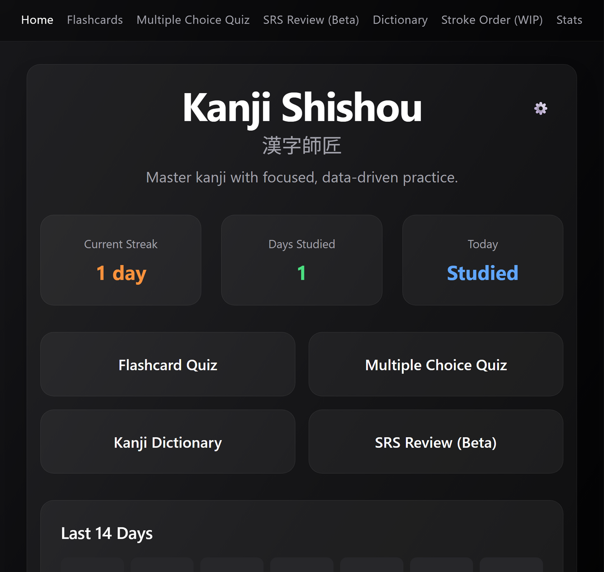
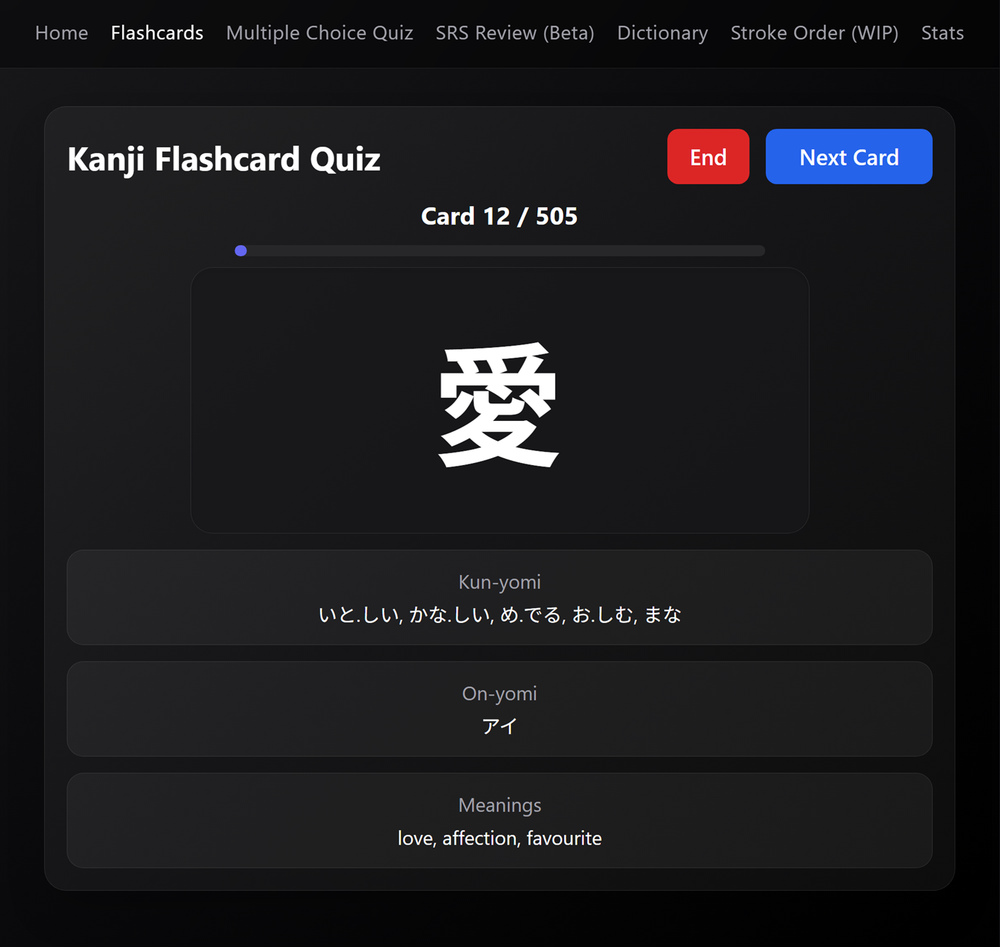
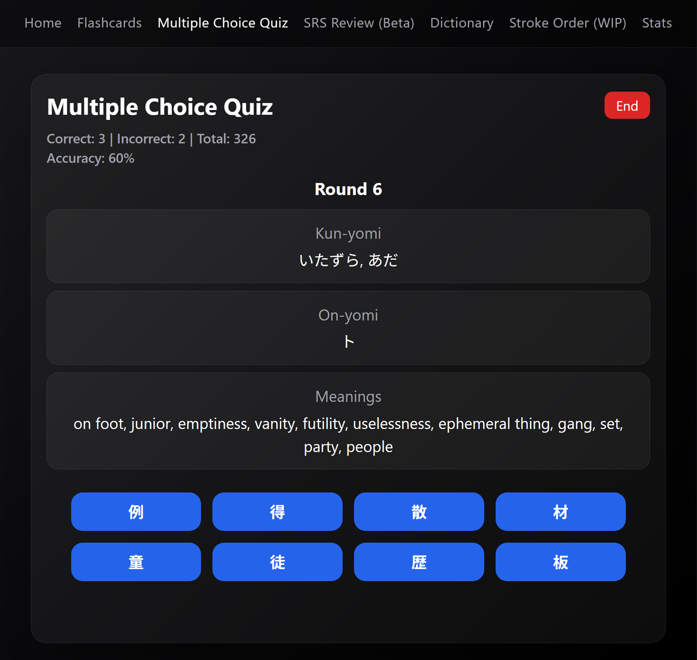
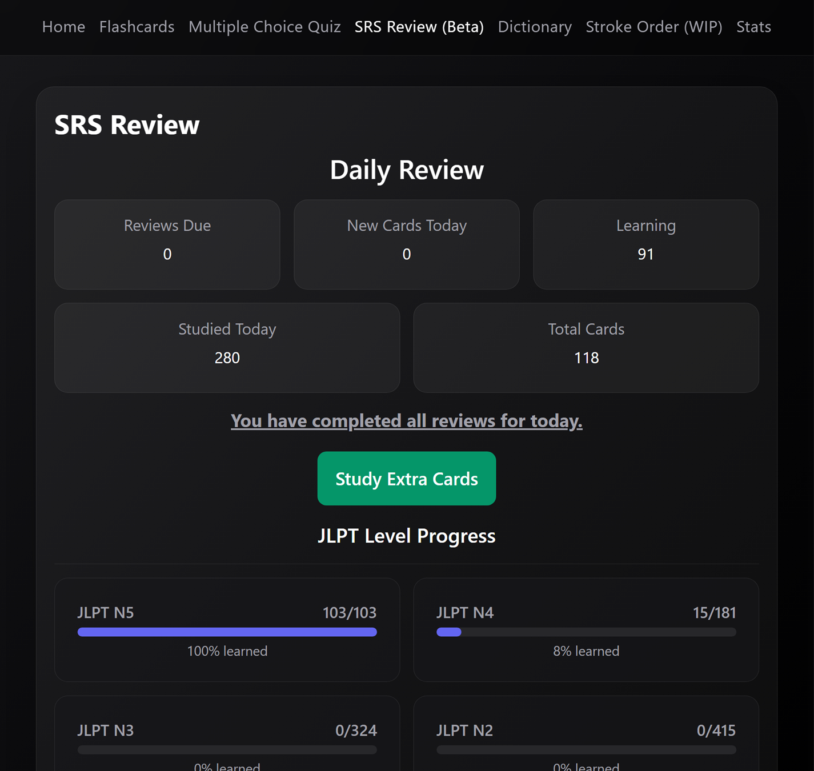
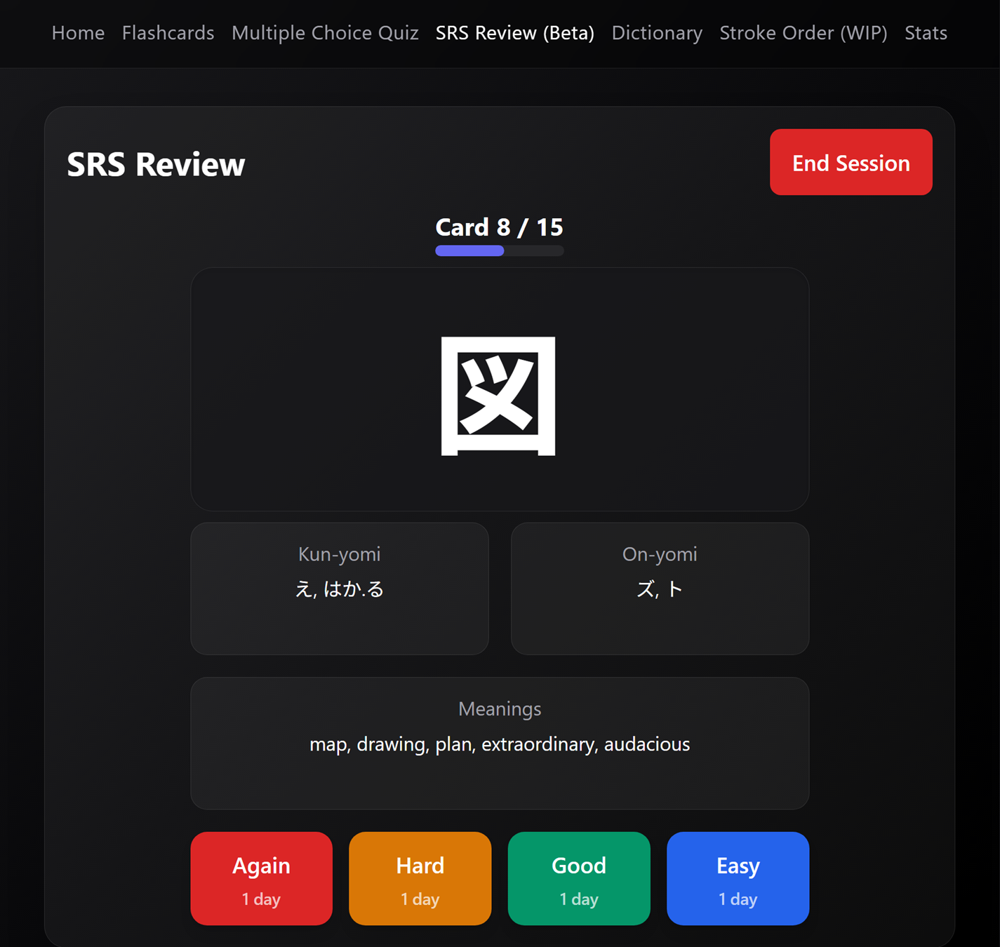
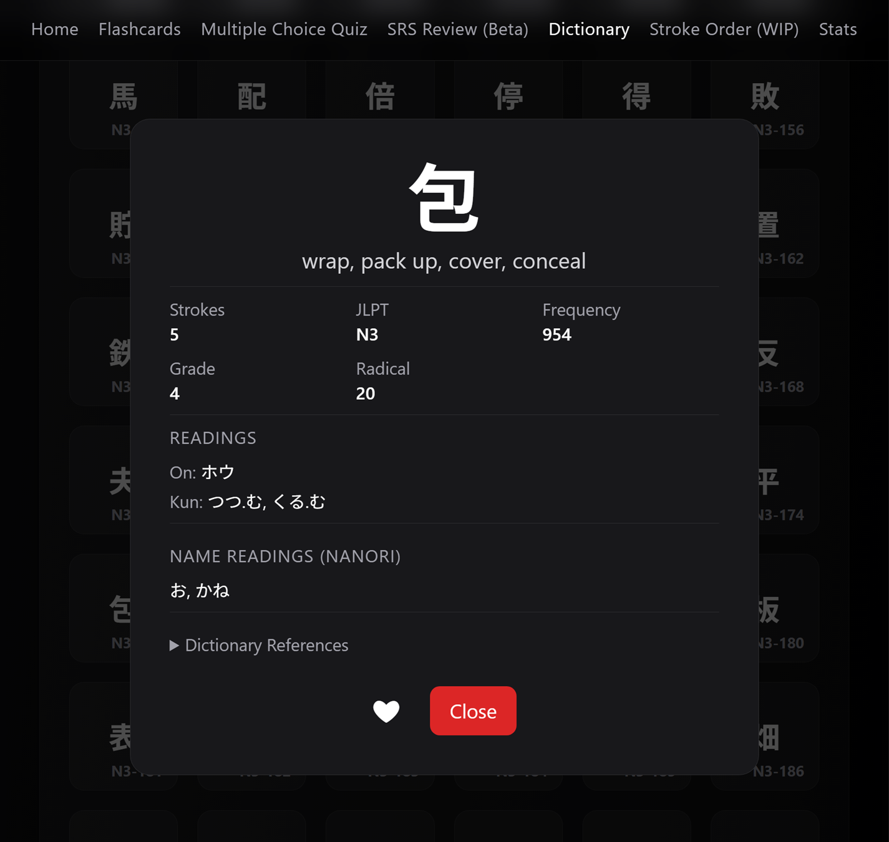
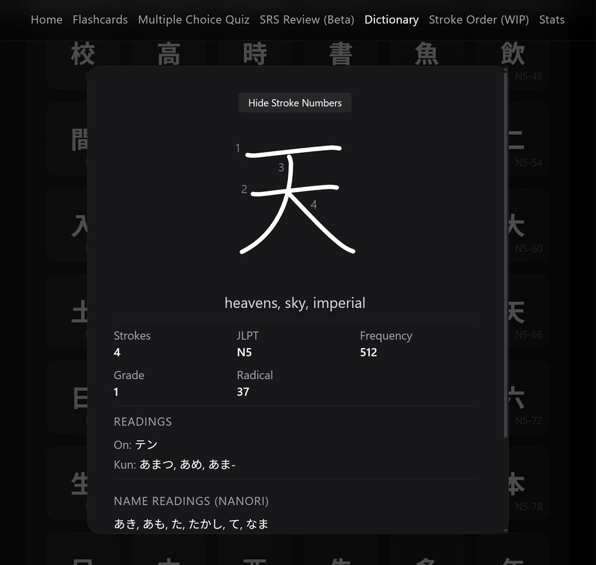
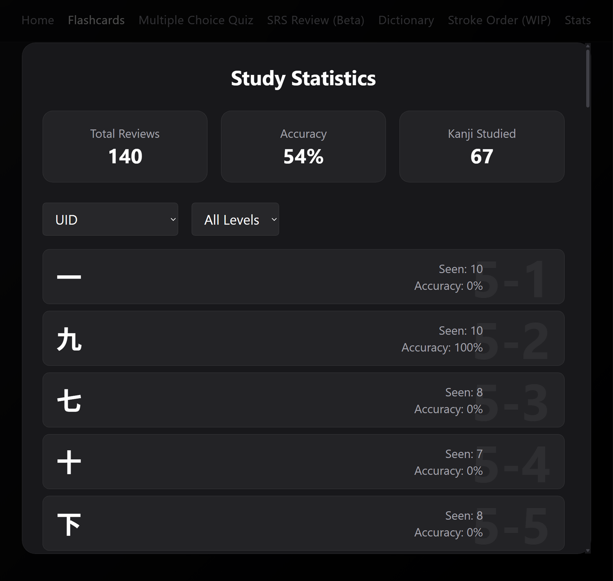

# Kanji Shishou (漢字師匠)

An interactive web app designed to help users study and master Japanese kanji effectively. This tool combines powerful features like flashcard quizzes, kanji dictionaries, and more to make kanji learning engaging and accessible.

## Features

- **Flashcard Quiz:** Test your kanji knowledge by matching words/definitions with the correct kanji.
- **Kanji Dictionary:** Browse and filter kanji by stroke count, JLPT level, and more.
- **Stroke Order Quiz (Stretch Goal):** Practice drawing kanji with correct stroke order to reinforce muscle memory.
- **SRS (Stretch Goal)**

## Screenshots

_Home Screen._

_Demonstration of the basic flashcard functionality._

_Multiple Choice Kanji Quiz._

_SRS Dashboard (WIP)._

_SRS Review Feature (WIP)._

_Fully-functional and customizable Kanji Dictionary resource._

_Kanji Dictionary Infocards._

_Stats Screen (WIP)._

## Project Goals

The goal of this utility is to provide a user-friendly platform for Japanese language learners at any level.

This project is still under active development, so new features and updates will be added regularly.

---

## Credits

- [nlohmann's JSON library](https://github.com/nlohmann/json) (used for development utilities)
- [KANJIDIC2](https://www.edrdg.org/kanjidic/kanjd2index_legacy.html) – Kanji database
- [KanjiVG](https://kanjivg.tagaini.net/) – Kanji stroke order SVG data

---

## License

This project is licensed under the MIT License.
