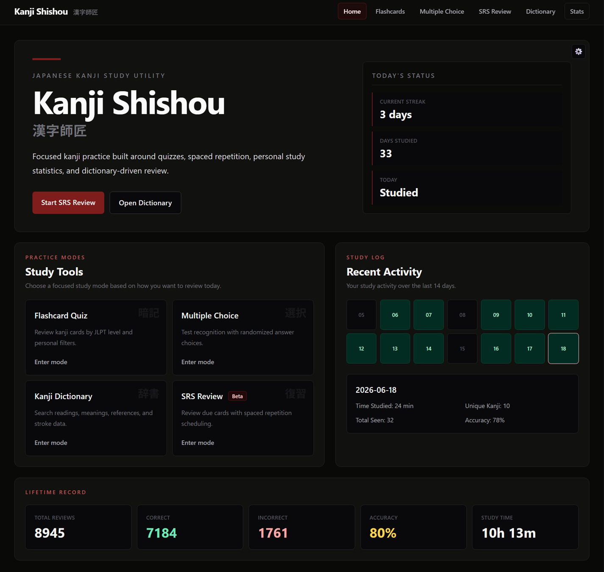
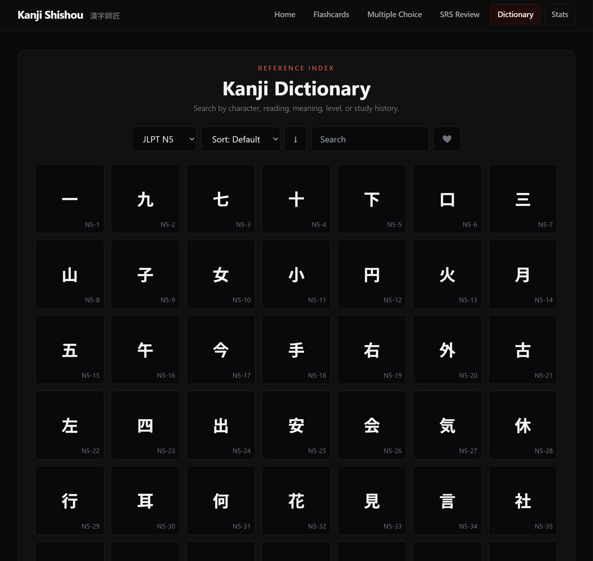
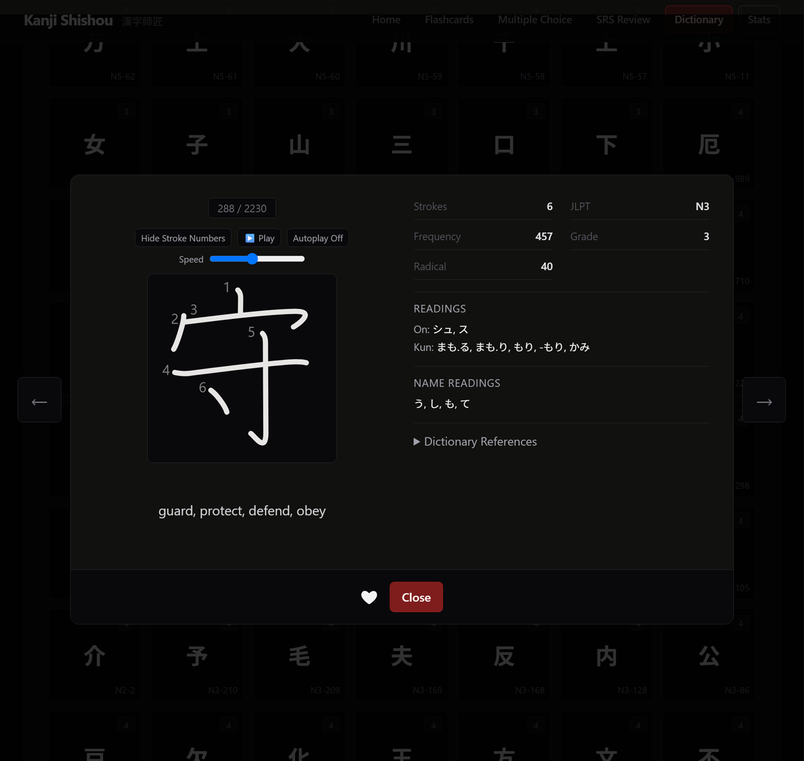
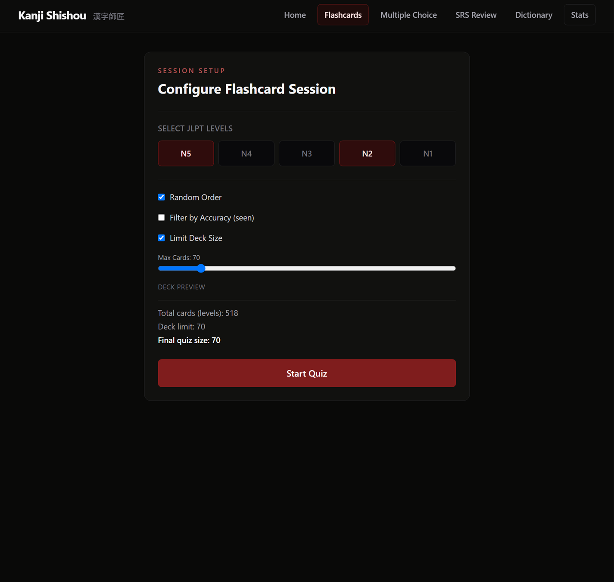
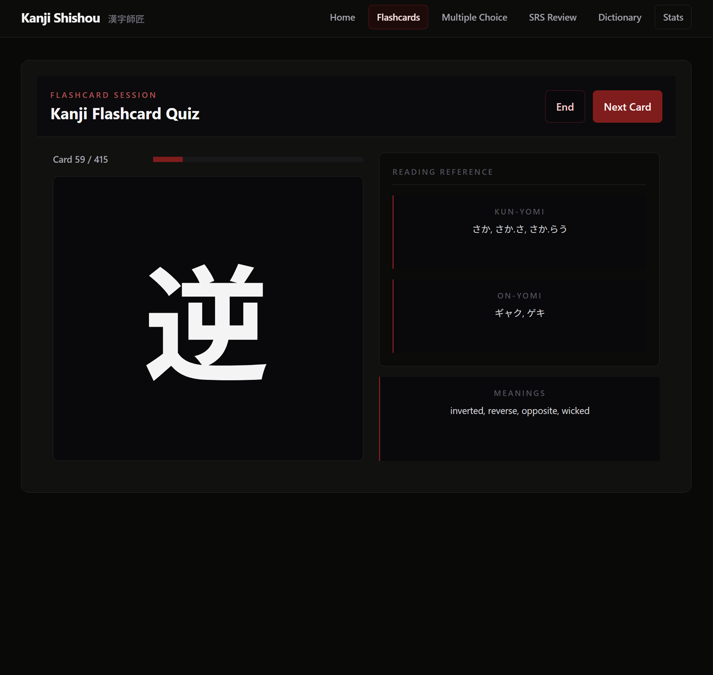
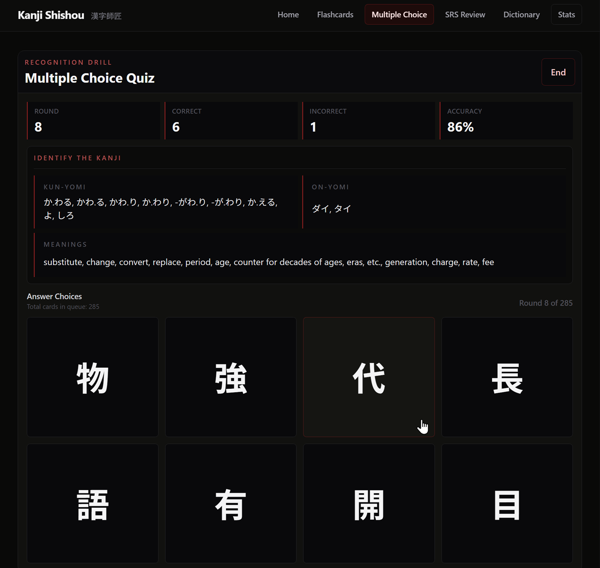
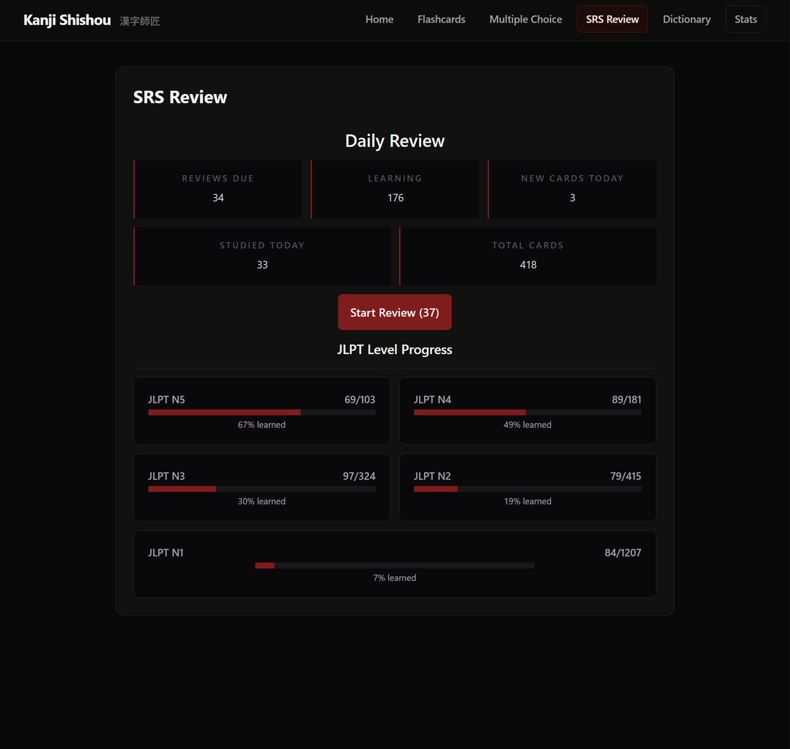
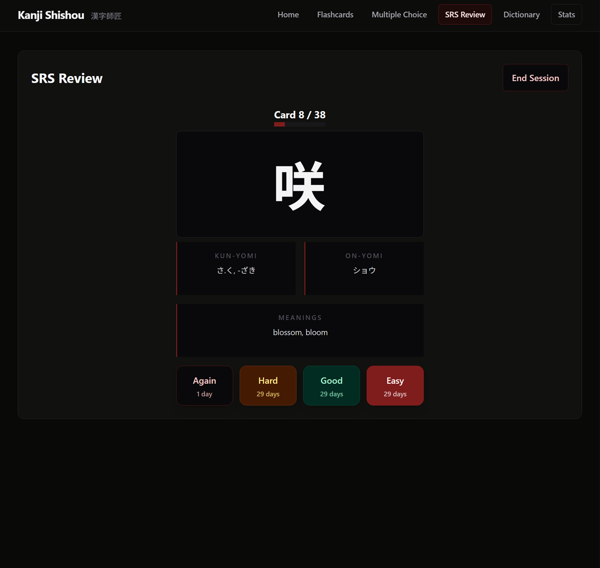
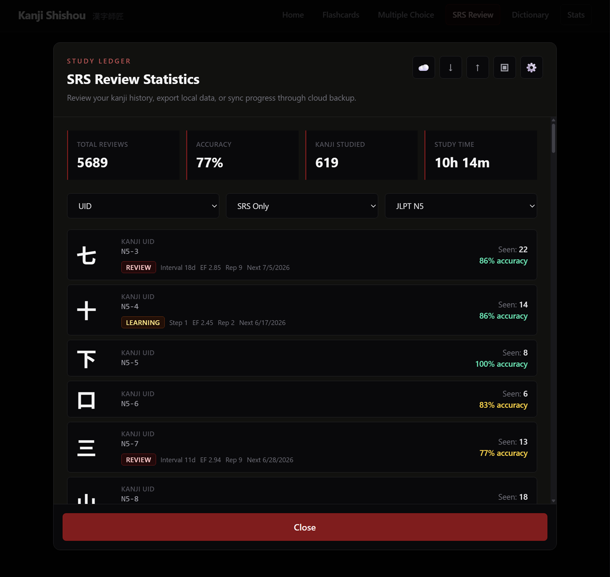
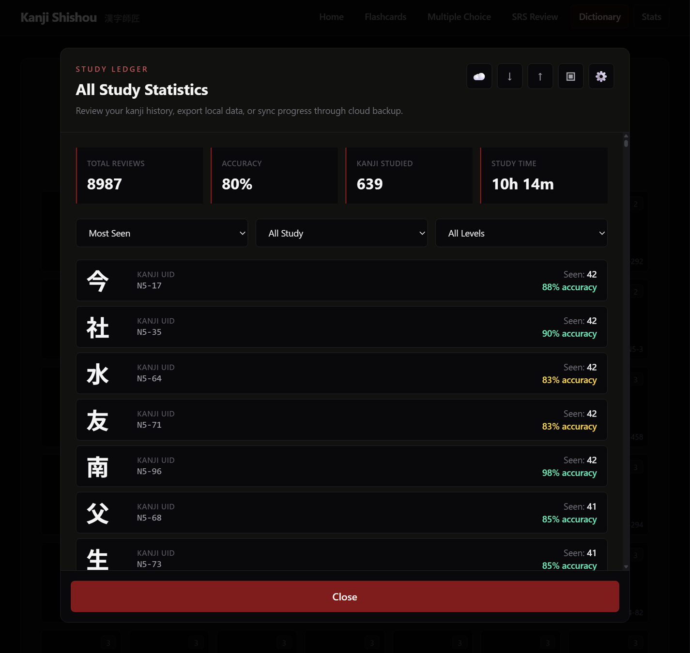

# Kanji Shishou (漢字師匠)

Kanji Shishou is a full-stack, local-first web app for studying Japanese kanji through quizzes, spaced repetition, dictionary lookup, stroke order reference, and progress tracking.

The app started as a simple kanji quiz tool, but has grown into a more complete study dashboard with persistent local progress, optional cloud backup, SRS review sessions, demo-mode onboarding, and detailed statistics.

**Live Demo:** https://kanji.stef-lev.xyz/

---

## Overview

Kanji Shishou is designed around the way I personally wanted to study kanji: quick review sessions, useful dictionary data, visible progress, and minimal friction.

User progress is saved locally in the browser by default, with cloud backup support for restoring progress across devices.

---

# Features

## Flashcard Quiz

A simple flashcard-style review mode for kanji exposure and reading practice.

Users can configure sessions by JLPT level, randomize card order, limit deck size, or filter cards based on existing accuracy data.

## Multiple Choice Quiz

A recognition-based quiz mode where users identify the kanji that matches a set of readings and meanings.

The quiz tracks correct and incorrect answers, updates study statistics, records daily activity, and optionally repeats missed cards later in the session.

## SRS Review (Beta)

A spaced repetition review system for building long-term kanji retention.

The SRS system tracks learning and review cards, daily review limits, new cards per day, review intervals, ease factor, repetitions, and next review dates.

## Kanji Dictionary

A searchable kanji dictionary built from KANJIDIC data.

Users can browse and filter kanji by JLPT level, search by kanji/readings/meanings, sort by study statistics, stroke count, frequency, JLPT level, and more.

## Stroke Order Viewer

Kanji stroke order diagrams are powered by KanjiVG SVG data.

The viewer supports playback animation, stroke number toggling, autoplay, and speed adjustment.

## Statistics and Progress Tracking

Kanji Shishou tracks both general study stats and SRS-specific stats.

## Local Backups and Snapshots

Users can export and import their progress as JSON backup files.

The app also creates periodic local snapshots, allowing users to restore previous local states if needed.

## Optional Cloud Backup

Kanji Shishou includes a small Express/SQLite backend for optional cloud backups.

Users can create a cloud backup, receive a Backup ID and Passkey, update that backup later, and restore it from another browser/device.

---

## Screenshots

  
_Searchable and filterable kanji dictionary._

  
_Detailed kanji info panel with readings, meanings, metadata, and stroke order data._

  
_Configurable quiz setup with JLPT filters and deck limits._

  
_Flashcard review mode for focused kanji exposure._

  
_Recognition-based multiple choice quiz with live session stats._

  
_SRS overview with daily review counts and JLPT level progress._

  
_Spaced repetition review flow with answer grading._

  
_SRS-specific statistics breakdown._

  
_Statistics, preferences, backup tools, snapshots, and cloud backup access._

---

## Tech Stack

### Frontend

- React
- TypeScript
- Vite
- Tailwind CSS
- React Router
- Framer Motion

### Backend

- Node.js
- Express
- TypeScript
- SQLite3

### Data Sources

- KANJIDIC2 for kanji dictionary data
- KanjiVG for stroke order SVG data

---

## Project Status

Kanji Shishou is actively evolving, but the core study tools are functional:

- Flashcard quiz
- Multiple choice quiz
- Kanji dictionary
- Stroke order viewer
- SRS review
- Statistics tracking

Planned or possible future improvements include:

- Public progress profiles
- Optional leaderboard features
- More detailed achievement tracking
- Improved backup metadata and cloud sync status
- Additional SRS tuning
- More refined mobile layouts

---

## Credits

- [KANJIDIC2](https://www.edrdg.org/kanjidic/kanjd2index_legacy.html) – Kanji dictionary data
- [KanjiVG](https://kanjivg.tagaini.net/) – Kanji stroke order SVG data
- [nlohmann/json](https://github.com/nlohmann/json) – Used in earlier data-processing utilities

---

## License

This project is licensed under the MIT License.

See the [LICENSE](LICENSE) file for details.
